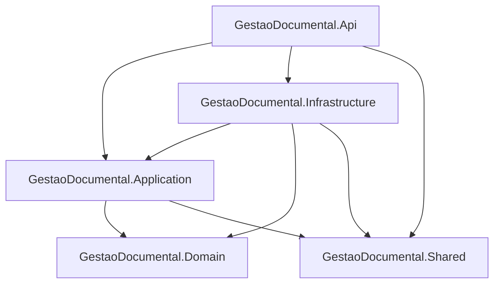

# Arquitetura — Visão geral

## Clean Architecture aplicada

O backend segue uma **Clean Architecture simplificada**: a lógica de negócio fica no centro (Application + Domain) e as dependências apontam para dentro. A API e a Infrastructure dependem do Application; o Domain não depende de nenhum outro projeto da solution.

Objetivos desta organização:

- Isolar regras de negócio do EF Core e do ASP.NET
- Facilitar testes e evolução (ex.: trocar storage local por cloud)
- Manter controllers finos, apenas como entrada HTTP

## Projetos da solution

Solution: `GestaoDocumental.sln` (raiz do repositório)

| Projeto | Responsabilidade |
|---------|------------------|
| **GestaoDocumental.Api** | Entrada HTTP: controllers, middleware, Swagger, AutoMapper profiles da API, `Program.cs` |
| **GestaoDocumental.Application** | Casos de uso: services, DTOs, FluentValidation, interfaces, helpers de negócio |
| **GestaoDocumental.Domain** | Modelo de domínio: entidades (incl. legado), interfaces de repositório, read models |
| **GestaoDocumental.Infrastructure** | Implementação técnica: DbContext, migrations, repositórios, JWT, BCrypt, storage local, CSV, seed |
| **GestaoDocumental.Shared** | Código partilhado: `AppRoles`, `AppPolicies`, settings (`JwtSettings`, `StorageSettings`), respostas de erro |

## Fluxo de uma requisição

```
HTTP Request
    → Controller (Api)
        → Service (Application)
            → Repository (Infrastructure)
                → DbContext (Infrastructure)
                    → SQL Server
```

Exemplo concreto — listar documentos:

1. `DocumentoController.GetAll()` recebe o pedido autenticado
2. Chama `IDocumentoService.GetAllAsync()`
3. O service usa `IGenericRepository<Documento>` (implementado em Infrastructure)
4. O repositório consulta `GestaoDocumentalDbContext`
5. O resultado sobe como entidades/DTOs e é devolvido em JSON

Para upload de ficheiros, o fluxo inclui também `IFileStorageService` (gravação em disco) antes de persistir `DocumentoAnexo`.

## Responsabilidades por projeto

### GestaoDocumental.Api

- Configuração de JWT, authorization policies, Swagger, EF Core connection
- `[Authorize]` e policies nos controllers
- `GlobalExceptionMiddleware` — converte exceções em JSON padronizado
- Seed automático no arranque (`IdentityDataSeeder.SeedAsync`)
- **Não deve** conter regras de negócio complexas

### GestaoDocumental.Application

- `GenericService<T>` e services especializados (`DocumentoService`, `TramitacaoDocumentoService`, `DashboardService`, `AuthService`)
- Validações FluentValidation
- Constantes de workflow (`DocumentoWorkflowConstants`)
- DTOs de entrada/saída
- **Não referencia** EF Core nem ASP.NET diretamente

### GestaoDocumental.Domain

- Entidades em `Entities/Legacy` (modelo alinhado à BD legada)
- `BaseEntity` com `Id`, `DataCriacao`, `DataAtualizacao`, `Ativo`
- Interfaces: `IGenericRepository`, `IUnitOfWork`, repositórios especializados
- Read models (ex.: dashboard)

### GestaoDocumental.Infrastructure

- `GestaoDocumentalDbContext` e configurações EF
- Migrations em `Data/Migrations`
- Implementações de repositórios e `UnitOfWork`
- `JwtTokenGenerator`, `PasswordHasher` (BCrypt), `LocalFileStorageService`, `CsvExportService`
- Registo DI em `InfrastructureServiceCollectionExtensions`

### GestaoDocumental.Shared

- Constantes e settings reutilizáveis
- Evita duplicação entre Api, Application e Infrastructure

## Padrões utilizados

| Padrão | Onde |
|--------|------|
| Generic Repository | `GenericRepository<T>` + interfaces no Domain |
| Generic Service | `GenericService<T>` + CRUD base |
| Unit of Work | `IUnitOfWork.SaveChangesAsync()` |
| DTO + AutoMapper | Api ↔ Application |
| FluentValidation | DTOs de entrada (ex.: workflow) |
| Middleware global | Tratamento centralizado de erros |
| Options pattern | `JwtSettings`, `StorageSettings` |

## Diagrama de dependências



## Onde procurar código por funcionalidade

| Funcionalidade | Local principal |
|----------------|-----------------|
| Endpoints HTTP | `GestaoDocumental.Api/Controllers/` |
| Regras de negócio | `GestaoDocumental.Application/Services/` |
| Entidades | `GestaoDocumental.Domain/Entities/` |
| Acesso a dados | `GestaoDocumental.Infrastructure/Data/Repositories/` |
| Migrations | `GestaoDocumental.Infrastructure/Data/Migrations/` |
| Segurança | `Program.cs`, `Shared/Security/`, `Infrastructure/Security/` |
| Ficheiros | `Infrastructure/Storage/LocalFileStorageService.cs` |
