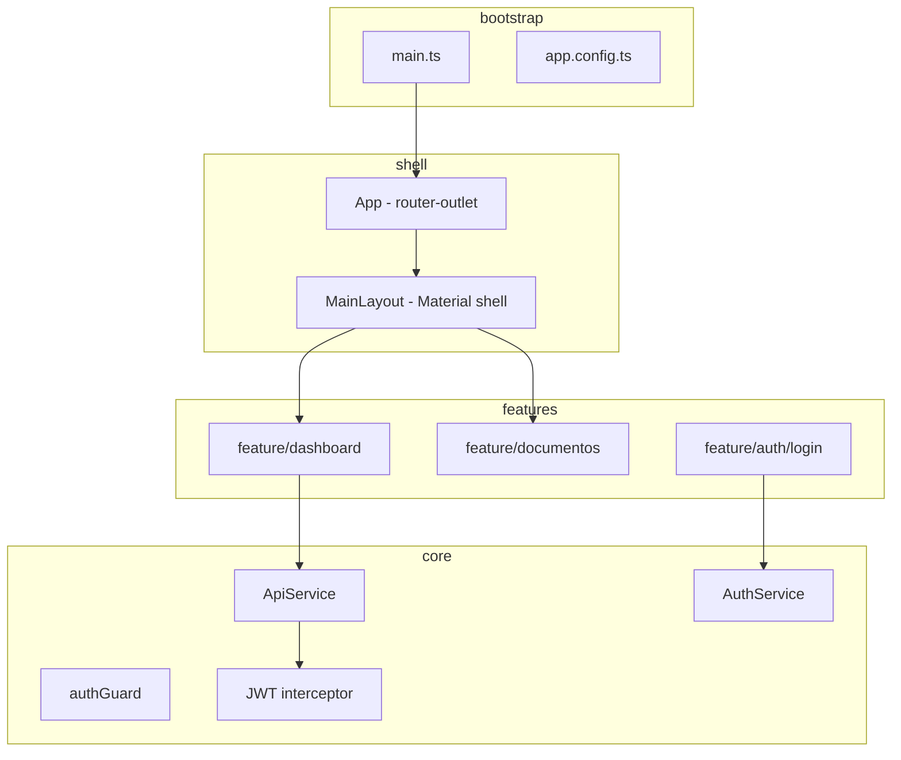

# Auditoria da estrutura do frontend Angular — GestãoDocumental

**Data:** 2026-05-25  
**Projeto:** `frontend/gestao-documental-web`  
**Tipo:** Auditoria apenas leitura — **nenhum ficheiro de código foi alterado**

---

## Resumo executivo

O frontend está numa fase **inicial e enxuta**, com arquitetura por pastas já iniciada (`core`, `features`, `layouts`). Usa **componentes standalone** (padrão Angular 21), **sem NgModules**, **sem Angular Material**, **sem guards**, **sem interceptors** e **sem pasta `shared` ou `models`**.

Existe um **layout funcional em CSS puro** (`MainLayout`) e uma **única página** (`Dashboard`). O `ApiService` está criado mas **ainda não é consumido** por nenhuma feature.

**Nota de versão:** o contexto menciona Angular 20; o `package.json` actual reporta **Angular 21.2.x** (CLI 21.2.13). A auditoria reflecte o que está instalado.

---

## Árvore actual de `src/app`

```
src/app/
├── app.ts                    # Root component (bootstrap)
├── app.html                  # <router-outlet />
├── app.css
├── app.config.ts             # Providers globais
├── app.routes.ts             # Rotas
├── app.spec.ts
├── core/
│   └── services/
│       └── api/
│           └── api.service.ts
├── features/
│   └── dashboard/
│       └── pages/
│           └── dashboard/
│               ├── dashboard.ts
│               ├── dashboard.html
│               ├── dashboard.css
│               └── dashboard.spec.ts
└── layouts/
    └── main-layout/
        ├── main-layout.ts
        ├── main-layout.html
        ├── main-layout.css
        └── main-layout.spec.ts
```

### Fora de `src/app` (relevante)

```
src/
├── main.ts                   # bootstrapApplication(App, appConfig)
├── index.html
├── styles.css                # Global (quase vazio)
└── environments/
    ├── environment.ts
    └── environment.development.ts

public/
└── favicon.ico
```

---

## Standalone components

| Componente | Ficheiro | Standalone |
|------------|----------|------------|
| `App` | `app.ts` | Sim (implícito v21; `imports: [RouterOutlet]`) |
| `MainLayout` | `layouts/main-layout/main-layout.ts` | Sim (`imports: [RouterOutlet, RouterLink]`) |
| `Dashboard` | `features/dashboard/pages/dashboard/dashboard.ts` | Sim (`imports: []`) |

- **Não existem** ficheiros `*.module.ts` nem `NgModule`.
- Alinhado com `.cursor/rules/cursor.mdc`: standalone por defeito, sem `standalone: true` explícito.

**Bootstrap:** `main.ts` usa `bootstrapApplication` (não `platformBrowserDynamic().bootstrapModule`).

---

## Angular Material

| Verificação | Resultado |
|-------------|-----------|
| `@angular/material` em `package.json` | **Não instalado** |
| `@angular/cdk` | **Não instalado** |
| Temas Material em `angular.json` / `styles.css` | **Não** |

**Conclusão:** para layout profissional com Material será necessária **instalação e configuração** (`ng add @angular/material`) numa fase posterior, sem recriar o projecto.

---

## Arquitectura por camadas (estado actual)

| Camada | Existe? | Conteúdo actual |
|--------|---------|-----------------|
| **core** | Parcial | Só `services/api/api.service.ts` |
| **shared** | Não | — |
| **features** | Parcial | Só `dashboard` |
| **layouts** | Sim | `main-layout` |
| **pages** | Sim (dentro de features) | `features/dashboard/pages/dashboard` |

Padrão adoptado: **feature → pages → component** (bom para escalar).

---

## Layouts existentes

### `MainLayout` (`layouts/main-layout/`)

- **Selector:** `app-main-layout`
- **Estrutura:** sidebar + topbar + `<router-outlet />` para conteúdo filho
- **Navegação (sidebar):** links para `/dashboard`, `/documentos`, `/colaboradores`, `/workflow`
- **Estilo:** CSS custom em `main-layout.css` (flex, cores tipo slate/gray)
- **Material:** não usa

**Preservar:** este componente como base do shell da aplicação; evoluir in-place para Material (sidenav, toolbar, list) em vez de criar um segundo layout paralelo.

---

## Páginas existentes

| Rota | Componente | Ficheiros | Estado |
|------|------------|-----------|--------|
| `/dashboard` | `Dashboard` | `features/dashboard/pages/dashboard/*` | Placeholder (título + parágrafo) |
| `/documentos` | — | — | **Link no menu, rota inexistente** |
| `/colaboradores` | — | — | **Link no menu, rota inexistente** |
| `/workflow` | — | — | **Link no menu, rota inexistente** |

Não existem pastas `pages/` fora de `dashboard`.

---

## Components existentes (lista completa)

| Nome | Tipo | Path |
|------|------|------|
| `App` | Root | `app.ts` |
| `MainLayout` | Layout | `layouts/main-layout/main-layout.ts` |
| `Dashboard` | Page/Feature | `features/dashboard/pages/dashboard/dashboard.ts` |

**Total de componentes de aplicação:** 3 (+ ficheiros `.spec.ts` de teste).

Não existem: componentes partilhados, pipes, directives, dialogs, tabelas, formulários de domínio.

---

## Services existentes

| Service | Path | `providedIn` | Uso actual |
|---------|------|--------------|------------|
| `ApiService` | `core/services/api/api.service.ts` | `'root'` | **Nenhum** inject detectado em components |

**Métodos:** `get`, `post`, `put`, `delete` genéricos com `baseUrl` de `environment.apiUrl`.

**Em falta (esperado para evolução):** `AuthService`, interceptors JWT, services por feature (`DashboardService`, `DocumentoService`, etc.).

---

## Models / interfaces

- **Não existe** pasta `models/`, `interfaces/` ou `types/` em `src/app`.
- DTOs do backend não estão espelhados no frontend.
- `ApiService.post/put` usa `data: any` (viola boas práticas do `.cursor/rules`, mas é estado actual).

---

## Guards

- **Nenhum** ficheiro `*.guard.ts`.
- Rotas **sem** `canActivate`, `canMatch` ou lazy loading com protecção.

---

## Interceptors

- **Nenhum** `HTTP_INTERCEPTORS` ou `provideHttpClient(withInterceptors(...))` em `app.config.ts`.
- Sem interceptor de JWT, erros globais ou loading.

---

## Rotas (`app.routes.ts`)

```typescript
export const routes: Routes = [
  {
    path: '',
    component: MainLayout,
    children: [
      { path: '', redirectTo: 'dashboard', pathMatch: 'full' },
      { path: 'dashboard', component: Dashboard }
    ]
  }
];
```

| URL | Comportamento |
|-----|---------------|
| `/` | Redirect → `/dashboard` |
| `/dashboard` | `Dashboard` dentro de `MainLayout` |
| Outras | **404** (incluindo links do menu) |

- **Sem** lazy loading (`loadComponent` / `loadChildren`).
- **Sem** rota de login.
- **Sem** wildcard `**`.

---

## Providers / `app.config.ts`

```typescript
export const appConfig: ApplicationConfig = {
  providers: [
    provideBrowserGlobalErrorListeners(),
    provideRouter(routes),
    provideHttpClient()
  ]
};
```

| Provider | Presente |
|----------|----------|
| Router | Sim |
| HttpClient | Sim |
| Animations (Material) | Não |
| Interceptors | Não |
| APP_INITIALIZER | Não |

---

## Environment

| Ficheiro | `production` | `apiUrl` |
|----------|--------------|----------|
| `environment.ts` | `true` | `https://localhost:7244/api` |
| `environment.development.ts` | `false` | `https://localhost:7244/api` |

### Inconsistências detectadas

1. **`angular.json` não define `fileReplacements`** para trocar `environment.ts` ↔ `environment.development.ts` em builds dev/prod. Ambos os ficheiros existem, mas o build pode usar sempre o mesmo import (`environment.ts` no `ApiService`).
2. **URL da API:** backend em dev usa frequentemente `http://localhost:5171` (perfil `http`); frontend aponta para **`https://localhost:7244/api`** — alinhar na fase de integração.
3. **`environment.development.ts` não é referenciado** em `api.service.ts` (import fixo de `environment`).

---

## Dependências (`package.json`)

**Runtime:** `@angular/*` 21.2, `rxjs` 7.8, `tslib`  
**Dev:** Vitest (testes), Prettier, Angular CLI/build 21.2.13  

**Ausentes (relevantes para evolução):** Angular Material, CDK, animações (`@angular/platform-browser/animations`), bibliotecas de ícones.

---

## Testes

| Ficheiro | Framework | Observação |
|----------|-----------|------------|
| `app.spec.ts` | Vitest via `@angular/build:unit-test` | Teste espera `h1` "Hello, gestao-documental-web" — **desalinhado** com `app.html` actual (só `router-outlet`) |
| `main-layout.spec.ts` | Idem | Smoke test de criação |
| `dashboard.spec.ts` | Idem | Smoke test de criação |

---

## Duplicações e inconsistências

| # | Problema | Impacto |
|---|----------|---------|
| 1 | Menu com 4 rotas, só 1 registada | Cliques em Documentos/Colaboradores/Workflow falham |
| 2 | Dois ficheiros environment sem wiring no build | Confusão dev vs prod |
| 3 | `apiUrl` HTTPS 7244 vs API HTTP 5171 | Integração API pode falhar em dev |
| 4 | `app.spec.ts` desactualizado | Falso negativo/positivo em CI local |
| 5 | `Dashboard` com estilos inline no HTML + ficheiro `.css` vazio | Estilo inconsistente vs layout |
| 6 | Utilizador referiu Angular 20, projecto é 21 | Documentação/equipa deve alinhar versão |

**Não há duplicação de layouts nem de dashboards** — estrutura única, o que é positivo para evolução.

---

## Ficheiros a preservar (não recriar do zero)

| Ficheiro / pasta | Motivo |
|------------------|--------|
| `src/app/app.routes.ts` | Estrutura parent/child com `MainLayout` correcta |
| `src/app/app.config.ts` | Bootstrap de router + HTTP |
| `src/app/layouts/main-layout/*` | Shell UI e navegação já definidos |
| `src/app/features/dashboard/pages/dashboard/*` | Primeira feature; evoluir conteúdo |
| `src/app/core/services/api/api.service.ts` | Base HTTP reutilizável |
| `src/environments/*.ts` | Configuração API (ajustar URLs, não apagar) |
| `src/main.ts` | Entry point standalone |
| `.cursor/rules/cursor.mdc` | Convenções do projecto (standalone, signals, a11y) |

---

## Ficheiros a evoluir (não substituir por duplicados)

| Ficheiro | Evolução sugerida |
|----------|-------------------|
| `main-layout.html` / `.css` | Migrar para `mat-sidenav-container`, `mat-toolbar`, `mat-nav-list` |
| `main-layout.ts` | Imports Material; opcional menu dinâmico a partir de config |
| `dashboard.ts` / `.html` | Consumir `GET /api/Dashboard/documentos/resumo` via service |
| `api.service.ts` | Tipar payloads; `inject(HttpClient)`; path aliases |
| `app.routes.ts` | Lazy routes por feature; guards; rotas em falta ou remover links |
| `app.config.ts` | `provideAnimationsAsync()`, interceptors, `withInterceptors` |
| `styles.css` | Tema global + Material theme |
| `environment*.ts` + `angular.json` | `fileReplacements` e URL correta da API |
| `app.spec.ts` | Alinhar com template real |

---

## Diretórios recomendados a criar (fase seguinte)

Sem criar agora — apenas recomendação:

```
src/app/
├── core/
│   ├── guards/              # auth.guard.ts
│   ├── interceptors/        # auth.interceptor.ts, error.interceptor.ts
│   ├── services/
│   │   ├── api/             # (existente)
│   │   └── auth/            # auth.service.ts
│   └── models/              # ou interfaces/ — DTOs partilhados
├── shared/
│   ├── components/          # loading, confirm-dialog, page-header
│   ├── pipes/
│   └── ui/                  # wrappers Material reutilizáveis
├── features/
│   ├── auth/
│   │   └── pages/login/
│   ├── dashboard/           # (existente — evoluir)
│   ├── documentos/
│   │   ├── pages/
│   │   └── services/
│   ├── colaboradores/
│   └── workflow/
└── layouts/
    ├── main-layout/         # (existente — evoluir)
    └── auth-layout/         # opcional: shell sem sidebar para login
```

---

## Arquitectura final recomendada (sem aplicar)



**Princípios:**

1. **Um único layout autenticado** (`MainLayout`) — evoluir com Material, não criar `main-layout-v2`.
2. **Features isoladas** com `pages/`, `services/`, `models/` locais.
3. **Core** só para cross-cutting (HTTP, auth, guards, interceptors).
4. **Shared** só para UI reutilizável (não lógica de negócio).
5. **Lazy loading** por feature quando houver mais de 2–3 rotas.
6. **Login** fora do `MainLayout` (rota sibling ou `AuthLayout`).

---

## Recomendações para layout profissional com Angular Material

### Fase 1 — Fundação (sem duplicar pastas)

1. `ng add @angular/material` no projecto `gestao-documental-web`.
2. Configurar tema (ex.: Azure/Indigo) em `styles.css`.
3. Adicionar `provideAnimationsAsync()` em `app.config.ts`.

### Fase 2 — Evoluir `MainLayout` in-place

| Actual (CSS) | Equivalente Material |
|--------------|-------------------|
| `.sidebar` | `mat-sidenav` + `mat-nav-list` |
| `.topbar` | `mat-toolbar` |
| `.page-content` | `mat-sidenav-content` com padding |
| Links `<a routerLink>` | `mat-list-item` com `routerLink` + `routerLinkActive` |

Opcional: `mat-icon` + `MatIconRegistry` para ícones de menu.

### Fase 3 — Dashboard

- Cards: `mat-card` para KPIs do resumo documental.
- Tabela: `mat-table` + `MatPaginator` para listas recentes.
- Estados: `mat-chip` para estados documentais.

### Fase 4 — Integração API

- Criar `features/dashboard/services/dashboard.service.ts`.
- Models em `features/dashboard/models/` ou `core/models/`.
- Auth: login page + token em `sessionStorage` + interceptor.

### Fase 5 — Rotas e menu

- Alinhar menu com rotas reais **ou** desactivar links até existirem features.
- Padrão de rota sugerido:

```
/login                    → AuthLayout (futuro)
/                         → MainLayout
  /dashboard
  /documentos
  /documentos/:id
  /colaboradores
  /workflow
```

---

## Checklist de verificação (resultado da auditoria)

| Item | Estado |
|------|--------|
| Mapeamento `src/app` | Concluído |
| Layouts | 1 (`MainLayout`) |
| Páginas | 1 (`Dashboard`) |
| Services | 1 (`ApiService`) |
| Models | 0 |
| Guards | 0 |
| Interceptors | 0 |
| Rotas documentadas | Concluído |
| `app.config.ts` | Concluído |
| Environment | Concluído (+ inconsistências notadas) |
| Standalone | Sim |
| Angular Material | Não instalado |
| Alterações de código | **Nenhuma** |
| Layout criado | **Nenhum** |
| Ficheiros apagados | **Nenhum** |

---

## Conclusão

O frontend está **bem encaminhado** para crescimento incremental: já separa `core`, `features` e `layouts`, usa standalone e tem shell + dashboard mínimos. **Não é necessário recriar o projecto** — basta instalar Material, evoluir `MainLayout` e `Dashboard`, completar `core` (auth/interceptors) e adicionar features sob `features/` sem duplicar componentes existentes.

Próximo passo recomendado (fora desta auditoria): instalar Angular Material e refactorizar **apenas** `main-layout` + tema global, mantendo rotas e `ApiService` actuais.
