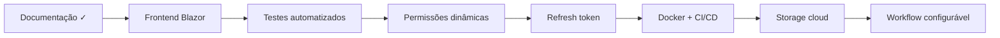

# Próximos passos (roadmap)

Roadmap sugerido após estabilização do backend e documentação, orientado para evolução do projecto GestãoDocumental.

---

## 1. Frontend Blazor

**Prioridade alta**

- Consumir `GET /api/Dashboard/documentos/resumo` no ecrã inicial
- Autenticação JWT no cliente (login, armazenamento seguro do token, refresh de UI por role)
- Ecrãs: listagem/detalhe de documentos, upload, workflow, relatórios de download
- HttpClient configurado com interceptor Bearer

**Dependências backend já prontas:** Auth, Documento, TramitacaoDocumento, Dashboard, policies.

---

## 2. Refresh token

**Prioridade média**

Estado actual: JWT expira após `ExpiryMinutes` (default 60 min); utilizador precisa de novo login.

Evolução:

- Endpoint `/api/Auth/refresh`
- Tabela ou store de refresh tokens revogáveis
- Rotação de tokens e logout explícito

---

## 3. Permissões dinâmicas

**Prioridade média**

Estado actual: policies mapeadas a **roles fixas** em `Program.cs`.

Evolução:

- Permissões por perfil na BD
- Policy provider customizado ou claims adicionais no JWT
- Restringir CRUD genérico de referências (actualmente `[Authorize]` apenas)

---

## 4. Workflow configurável

**Prioridade média**

Estado actual: estados e transições em `DocumentoWorkflowConstants`; `EnsureEstadoDocumentoAsync` cria estados on-the-fly.

Evolução:

- Matriz de transições configurável
- Estados iniciais consistentes na criação de documento
- Validação por tipo de documento ou direcção

---

## 5. Storage cloud

**Prioridade média-baixa**

Estado actual: `LocalFileStorageService` → pasta `storage/documentos`.

Evolução:

- Interface `IFileStorageService` já permite substituição
- Implementação Azure Blob / AWS S3
- URLs assinadas para download (opcional)

---

## 6. Testes automatizados

**Prioridade alta para qualidade**

Áreas críticas sem cobertura formal documentada:

- Workflow (aprovar/rejeitar/encaminhar e regras de estado)
- Upload/download e soft delete
- Policies (401/403 por role)
- Relatórios e exportação CSV

Sugestão: projecto `GestaoDocumental.Tests` com xUnit + WebApplicationFactory.

---

## 7. Docker

**Prioridade média**

- `Dockerfile` multi-stage para Api
- `docker-compose` com SQL Server + API
- Volume para `storage/documentos`
- Documentar migrations no entrypoint (com cuidado em BD legada)

---

## 8. CI/CD

**Prioridade média**

Pipeline mínimo:

1. `dotnet build`
2. `dotnet test` (quando existirem)
3. Análise estática / format check
4. Deploy controlado com `dotnet ef database update` apenas em ambientes aprovados

**Nunca** executar drop/recreate de BD em pipeline.

---

## Melhorias menores identificadas no backend actual

| Área | Melhoria |
|------|----------|
| Anexos | Restaurar anexo soft-deleted; delete físico opcional |
| Anexos | Coluna `Versao` e `TipoMime` na BD |
| Auth | Expor ou remover `RegisterAsync` de forma consciente |
| Dashboard | Filtros por utilizador/direcção |
| CRUD referências | Policies de escrita para Administrador |
| Documento seed | Alinhar estado inicial a `Pendente` |

---

## Ordem sugerida de execução

A ordem pode ajustar-se consoante prioridade de negócio; Blazor e testes são os passos mais naturais imediatamente após esta documentação.
